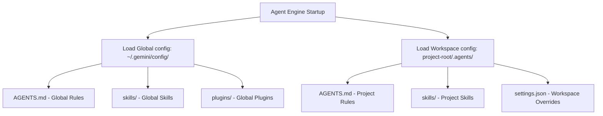

# Google Antigravity (AGY): Developer Capabilities & Architecture Reference

This reference is tailored for software engineers who want a clear, technical understanding of Google Antigravity's architecture, tool execution model, customization model, and lifecycle hooks, without high-level marketing wrappers.

---

## 1. System Architecture & Surfaces

Antigravity operates as a modular agentic platform accessible via four distinct runtime interfaces, all powered by the same underlying agent engine:

### A. Antigravity 2.0 (Desktop Application)
An Electron-based desktop application providing an orchestration center independent of your IDE.
*   **Chat Canvas & Auxiliary Pane**: Offers a split view displaying the active chat conversation alongside system operations (subagents, terminals, background tasks, artifacts, file diffs).
*   **Context Control**: Drag-and-drop media ingestion, `@` mentions for system reference mounting, and background task management.
*   **Scheduling Core**: Houses the client-side scheduler for cron-like jobs and delayed timers.

### B. Antigravity IDE (VS Code Integration)
A standalone VS Code-based IDE wrapping agentic actions directly into the workspace canvas.
*   **Passive Autocomplete (Tab-to-Jump/Import)**: Low-latency next-keystroke suggestion engine. Predicts additions/deletions, injects package imports, and navigates cursor positions.
*   **Inline Commands (`Ctrl+I` / `⌘+I`)**: Instructive scoped edits. Highlights specific code blocks to prompt local refactoring, documentation generation, or compiler diagnostic auto-fixing.
*   **Sidebar Collaboration**: In-editor chat panel enabling full agentic runs (with code-writing and terminal rights).

### C. Antigravity CLI (`agy`)
A terminal-based TUI (`agy`) built for fast navigation, lightweight sessions, and keyboard-driven usage.
*   **Interactive Shell**: Custom slash commands, persistent command history, and custom TUI viewport layout (status bars, titles) managed by local terminal scripts.
*   **Config Storage**: State and preferences managed via `~/.gemini/antigravity-cli/settings.json`.

### D. Antigravity Python SDK (`google-antigravity`)
A public Python library enabling programmatic leasing, instantiation, and execution of agents within automated scripts, pipelines, or test suites.
*   **Asynchronous Context Manager**: Spawns and cleans up runtime binaries.
*   **Deltas & Events**: Real-time event streams exposing raw thought processes (`response.thoughts`) and strongly-typed tool invocations (`response.tool_calls`).
*   **Usage Pattern**:
    ```python
    import asyncio
    from google.antigravity import Agent, LocalAgentConfig, CapabilitiesConfig

    async def main():
        config = LocalAgentConfig(capabilities=CapabilitiesConfig())
        async with Agent(config) as agent:
            response = await agent.chat("Run test suite and fix failures")
            async for token in response:
                print(token, end="")
    ```

---

## 2. Core Agent Tools & Capabilities

The agent operates by generating a step-by-step plan and executing precise tool calls. The key categories of tools exposed to the agent include:

| Tool Category | Key API Endpoints / Functions | Description |
| :--- | :--- | :--- |
| **Workspace Navigation** | `list_dir`, `grep_search` | Ripgrep-powered recursive codebase searches, directory listings, and glob pattern filtering. |
| **File I/O** | `view_file`, `write_to_file`, `replace_file_content`, `multi_replace_file_content` | Safe line-range file viewing, full-write creation, contiguous single-chunk edits, and non-contiguous multi-chunk edits (reducing token overhead). |
| **Shell/Process Execution** | `run_command`, `manage_task` | Launches bash processes on the host shell. Supports persistent terminals sharing environment variables across calls. Can run processes asynchronously under background task IDs. |
| **Orchestration** | `define_subagent`, `invoke_subagent`, `send_message` | Multi-agent collaboration. Allows defining custom subagents with specific system prompts, scoping their workspaces, and communicating asynchronously over IPC. |
| **Network & Web** | `search_web`, `read_url_content`, `read_browser_page` | Web searching, static page HTML-to-Markdown conversion, and browser-driven page state evaluation (Playwright/Puppeteer style). |
| **Timer / Cron** | `schedule` | One-shot timers (e.g. terminating early on task event) or cron expressions (e.g. polling servers every 5 minutes). |

---

## 3. Customizations & Extensibility

Antigravity uses a declarative directory-based configuration model. It discovers configurations at two levels:
1.  **Global Customizations**: Loaded from `~/.gemini/config/`
2.  **Workspace Customizations**: Loaded from `<project-root>/.agents/`



### A. Rules (`AGENTS.md`)
Rules specify constraints, formatting styles, testing conventions, or architectural restrictions.
*   **Global Rules**: Appended to `~/.gemini/config/AGENTS.md`. Applies to all conversations.
*   **Project-scoped Rules**: Appended to `.agents/AGENTS.md`. Applies only to activities inside that specific project repository.

### B. Skills
Skills are folders of domain-specific instructions and assets. 
*   **Structure**: Must contain a `SKILL.md` file featuring YAML frontmatter (for registration and trigger matching):
    ```yaml
    ---
    name: go-standards
    description: Code styling, testing practices, and architecture rules for Go projects.
    ---
    # Skill instructions start here
    ...
    ```
*   **Assets**: Can contain subdirectories like `scripts/` (helper automation tools), `examples/` (reference code templates), `resources/` (data payloads), and `references/` (additional reading files).
*   **Discovery**: Skills are either auto-loaded from customization roots or registered using a `skills.json` file to inherit or exclude paths:
    ```json
    {
      "entries": [ { "path": "shared/team-skills" } ],
      "exclude": [ "unwanted-skill" ]
    }
    ```

### C. Plugins
Plugins bundle rules, skills, external tools, and subagent profiles into a unified package. They contain a `plugin.json` metadata manifest mapping the capabilities and registering lifecycle triggers.

### D. Model Context Protocol (MCP)
The agent integrates with external services using the Model Context Protocol. MCP allows developers to expose custom tools, prompts, or resources over JSON-RPC. MCP servers can be configured in your settings files and are dynamically queried by the agent when their schemas match the active prompt context.

---

## 4. Collaborative Workflow Mechanics

### A. Context Mounting (`@` Mentions)
You can target what details enter the agent's context window:
*   `@file` / `@directory`: Mounts paths directly.
*   `@conversation`: References history of other active/closed threads.
*   `@terminal`: Mounts stdout/stderr buffer history of active terminals.
*   `@rule`: Instructs the agent to prioritize a specific rule file.
*   `@mcp`: Exposes a specific tool from an MCP server directly.

### B. Interactive Slash Commands
*   `/goal`: Initiates high-thoroughness mode. The agent loops indefinitely, self-correcting and executing until verification criteria are fully satisfied.
*   `/schedule`: Launches a task scheduler for cron/timer configuration.
*   `/grill-me`: Triggers an interactive interview panel. The agent asks design questions to resolve ambiguity before executing plans.
*   `/teamwork-preview`: Initiates multi-agent preview, showing how a network of specialized subagents would partition a large task.
*   `/learn`: Saves system state, corrections, or setup scripts to rules files so they persist in future sessions.

### C. Lifecycle Hooks
Developers can register scripts to execute at hook boundaries. Hooks can be defined globally (`settings.json`) or per-project (`.agents/settings.json`).

#### Supported Event Boundaries:
*   `SessionStart` / `SessionEnd`: Run on environment initialization/teardown.
*   `BeforeAgent` / `AfterAgent`: Run before planning or after the final completion step.
*   `BeforeModel` / `AfterModel`: Intercept prompt payloads going to the LLM, or response text returning from it (e.g. for sensitive data redaction).
*   `BeforeToolSelection`: Intercept available tool listings.
*   `BeforeTool` / `AfterTool`: Triggered before/after a tool (like `run_command` or `write_file`) executes.

#### Hook Types:
*   `command`: Executes a local script (returns exit code).
*   `http`: POSTs event JSON to webhooks or audit services.
*   `mcp_tool`: Runs an MCP tool immediately.
*   `prompt`: Prompts an LLM to evaluate logic constraints.
*   `agent`: Spawns a subagent to evaluate workspace correctness.

*Example configuration in settings:*
```json
"hooks": {
  "AfterTool": [
    {
      "matcher": "write_file",
      "hooks": [
        {
          "name": "Post-Write Linter",
          "type": "command",
          "command": "./.gemini/lint.sh"
        }
      ]
    }
  ]
}
```

---

## 5. Security & Access Policies

System permissions are controlled via `~/.gemini/antigravity-cli/settings.json` (or project-level overrides) using the following parameters:

*   **`allowNonWorkspaceAccess`** (`bool`): Blocks or allows file reading/writing outside the workspace directory structure.
*   **`enableTerminalSandbox`** (`bool`): Wraps all executed shell commands inside a sandbox (Linux namespaces/cgroups).
*   **`toolPermission`** (`string`): Options:
    *   `always-proceed`: Executes tools without user confirmation prompts.
    *   `request-review`: Prompts user before executing commands or reading sensitive resources.
    *   `strict`: Prompts on all tool executions.
    *   `proceed-in-sandbox`: Runs CLI commands inside sandbox without prompt, but asks for unsandboxed commands.
*   **`permissions`** (`object`): Declares granular allow/deny rules using pattern-matched expressions:
    ```json
    "permissions": {
      "allow": ["Read", "Write", "Bash(git *)"],
      "deny": ["Bash(rm -rf *)"],
      "ask": ["Bash"]
    }
  ```
