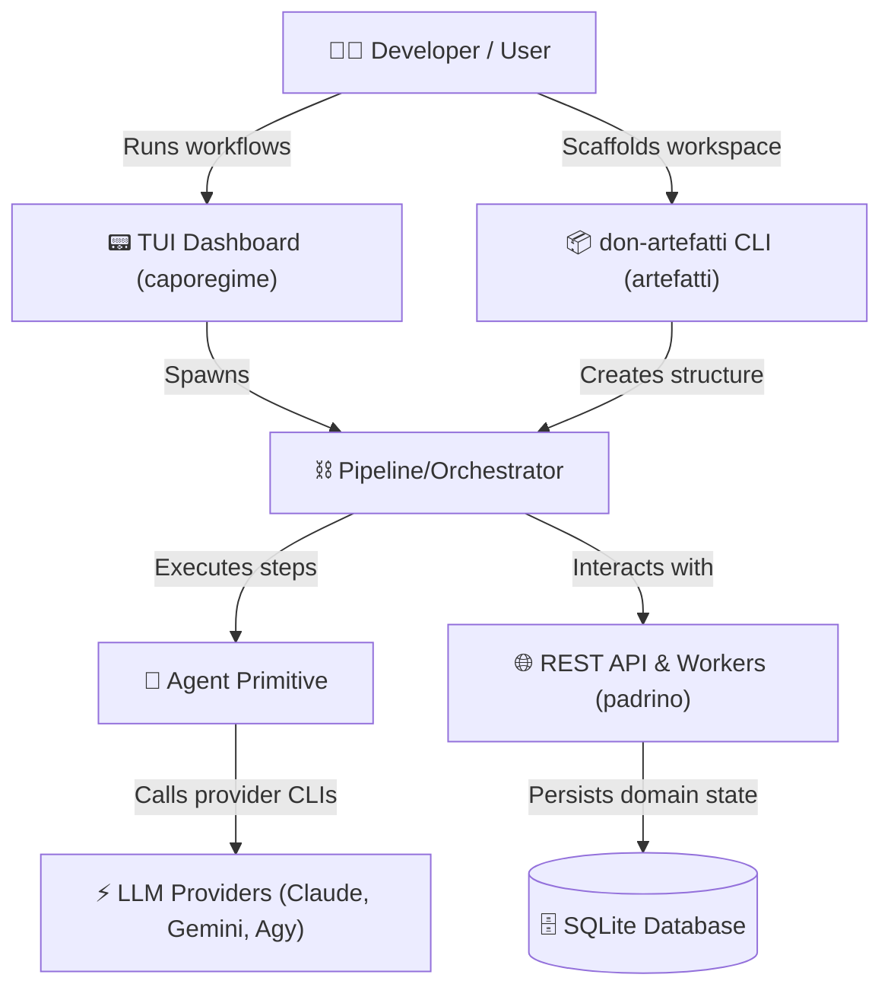

  

  <h1>🌹 Don </h1>

  

    <b><i>"Benvenuto alla famiglia."</i></b>
  

  

    
    
    
  

**Don** is a modern, modular monorepo containing frameworks, services, and CLI scaffolding tools designed for building,
orchestrating, and running AI-agent task pipelines.

> [⚠️WARNING]
> **padrino** is a Work In Progress (WIP) and **must not be used** as it is not ready.
>
> **caporegime** and **artefatti** are `v0.0.1-beta`.

---

photo of the same man from the reference image, maintaining his exact facial traits, expression, short hair, and
clothing. He is sitting directly at a dark, polished mahogany Capo table inside a dimly lit, luxurious Cosa Nostra mob
boardroom. The background features vintage leather chairs, subtle wisps of cigar smoke in the air, and warm, low-key
dramatic lighting casting deep shadows. The camera focus remains sharply on the man in the foreground, keeping the exact
same medium close-up framing, head tilt, and body proportion as the original image. Photorealistic, 8k resolution, shot
on 35mm lens, mafia atmosphere.

A former Architect and Urban Planner, tired of the construction sites, dust, and noise, now working as a Staff Engineer
at Visa. Proving that autistic people can also thrive in tech, inspiring others.

## 🗺️ Monorepo Overview

The project is structured into three primary, decoupled components:

| Component      | Language / Stack     | Directory                     | Description                                                                                 | Status / Version     |
|:---------------|:---------------------|:------------------------------|:--------------------------------------------------------------------------------------------|:---------------------|
| **caporegime** | Go (`1.26`+)         | [`/caporegime`](./caporegime) | Framework for AI agent pipeline execution & a Terminal UI (TUI) Dashboard orchestrator.     | `v0.0.1-beta`        |
| **padrino**    | Go (`1.26`+)         | [`/padrino`](./padrino)       | Core REST API backend and background worker service designed around Hexagonal Architecture. | **WIP (Do Not Use)** |
| **artefatti**  | Node.js (`>=14.0.0`) | [`/artefatti`](./artefatti)   | Zero-dependency CLI tool (`don-artefatti`) to scaffold `.artefatti` pipeline workspaces.    | `v0.0.1-beta`        |

---

## 📐 Architecture Flow

---

## 📂 Subprojects Deep Dive

### 🤖 [Don caporegime](./caporegime)

> [!NOTE]
> **Status**: `v0.0.1-beta`

`caporegime` is the brain of the operation. It abstracts interactions with external LLM CLI engines and provides clean
Go primitives to run autonomous multi-step pipelines.

* **Agent**: Atomic units of work configured with `Before` and `After` hooks.
* **AgentProvider**: Interface layer supporting backends like `ClaudeProvider`, `GeminiProvider`, and `AgyProvider`.
* **Pipeline**: Sequential steps that combine standard Go logic with Agent runs.
* **Orchestrator**: Manages workflow sequences, validation, and session states.
* **TUI Dashboard**: Interactive terminal interface to view real-time logs and workflow runs.

### 🏛️ [Don Padrino](./padrino)

> [!WARNING]
> ⚠️ **Status**: **Work in Progress (WIP) — Do not use, not ready.**

`padrino` is the backend foundation, structured around strict **Hexagonal Architecture (Ports and Adapters)**.

* **Purity**: `internal/core/domain/` has zero dependencies on frameworks, databases, or other internal packages.
* **Interface Segregation**: All interfaces are defined on the *consumer-side* (in the package that uses them) rather
  than the *producer-side*.
* **Stack**: Built on Echo (HTTP server), SQLite3 (database), golang-migrate (migrations), and structured slog loggers.

### 🌹 [Don Artefatti](./artefatti)

> [!NOTE]
> **Status**: `v0.0.1-beta`

`artefatti` is a Node scaffolding package to quickly configure pipeline workspaces.

* **Zero Dependencies**: Strictly avoids external `npm` dependencies, relying only on Node's core APIs.
* **CLI Scaffolder**: Run `don-artefatti` inside any directory to provision a workspace structure for orchestrating
  agent pipelines.

---

## 🚀 Quick Start & Run Commands

| Location      | Purpose                  | Command                        |
|:--------------|:-------------------------|:-------------------------------|
| `/caporegime` | Build all Go modules     | `go build ./...`               |
|               | Test primitives          | `go test ./pkg/primitives/...` |
|               | Run TUI CLI              | `go run cmd/cli/main.go`       |
| `/padrino`    | Boot up Echo API server  | `go run cmd/api/main.go`       |
|               | Run unit & adapter tests | `go test ./...`                |
| `/artefatti`  | Link package globally    | `npm link`                     |
|               | Test local scaffolding   | `node bin/cli.js`              |

---

## 🎨 Development Standards

* **Consumer-Side Interfaces**: Never define interfaces where they are implemented. Define them where they are consumed.
* **Structured Logging**: Always pass `context.Context` to all logging calls through the custom logger package wrapper.
* **Semantic Commits**: All commits must strictly follow the conventional commit specification (e.g.
  `feat(api): add auth filter`, `fix(TUI): adjust layout boundaries`).

---

## 📄 License

This project is licensed under the **GNU General Public License v3 (GPLv3)**. See the [LICENSE](./LICENSE) file for the
full terms and conditions.
