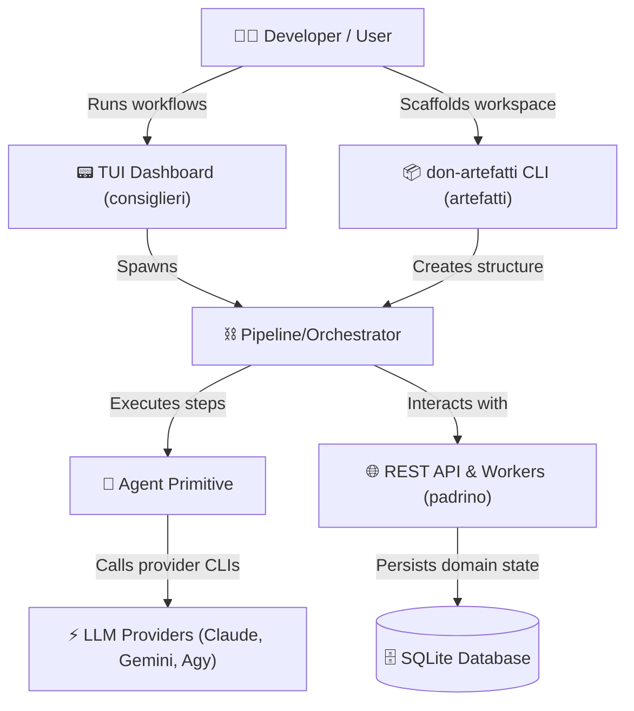

# 🌹 Don Monorepo

> "An agentic orchestration platform you can't refuse."

**Don** is a modern, modular monorepo containing frameworks, services, and CLI scaffolding tools designed for building, orchestrating, and running AI-agent task pipelines.

---

## 🗺️ Monorepo Overview

The project is structured into three primary, decoupled components:

| Component | Language / Stack | Directory | Description |
| :--- | :--- | :--- | :--- |
| **consiglieri** | Go (`1.26`+) | [`/consiglieri`](./consiglieri) | Framework for AI agent pipeline execution & a Terminal UI (TUI) Dashboard orchestrator. |
| **padrino** | Go (`1.26`+) | [`/padrino`](./padrino) | Core REST API backend and background worker service designed around Hexagonal Architecture. |
| **artefatti** | Node.js (`>=14.0.0`) | [`/artefatti`](./artefatti) | Zero-dependency CLI tool (`don-artefatti`) to scaffold `.artefatti` pipeline workspaces. |

---

## 📐 Architecture Flow

---

## 📂 Subprojects Deep Dive

### 🤖 [Don Consiglieri](./consiglieri)
`consiglieri` is the brain of the operation. It abstracts interactions with external LLM CLI engines and provides clean Go primitives to run autonomous multi-step pipelines.

*   **Agent**: Atomic units of work configured with `Before` and `After` hooks.
*   **AgentProvider**: Interface layer supporting backends like `ClaudeProvider`, `GeminiProvider`, and `AgyProvider`.
*   **Pipeline**: Sequential steps that combine standard Go logic with Agent runs.
*   **Orchestrator**: Manages workflow sequences, validation, and session states.
*   **TUI Dashboard**: Interactive terminal interface to view real-time logs and workflow runs.

### 🏛️ [Don Padrino](./padrino)
`padrino` is the backend foundation, structured around strict **Hexagonal Architecture (Ports and Adapters)**.

*   **Purity**: `internal/core/domain/` has zero dependencies on frameworks, databases, or other internal packages.
*   **Interface Segregation**: All interfaces are defined on the *consumer-side* (in the package that uses them) rather than the *producer-side*.
*   **Stack**: Built on Echo (HTTP server), SQLite3 (database), golang-migrate (migrations), and structured slog loggers.

### 🌹 [Don Artefatti](./artefatti)
`artefatti` is a Node scaffolding package to quickly configure pipeline workspaces.

*   **Zero Dependencies**: Strictly avoids external `npm` dependencies, relying only on Node's core APIs.
*   **CLI Scaffolder**: Run `don-artefatti` inside any directory to provision a workspace structure for orchestrating agent pipelines.

---

## 🚀 Quick Start & Run Commands

| Location | Purpose | Command |
| :--- | :--- | :--- |
| `/consiglieri` | Build all Go modules | `go build ./...` |
| | Test primitives | `go test ./pkg/primitives/...` |
| | Run TUI CLI | `go run cmd/cli/main.go` |
| `/padrino` | Boot up Echo API server | `go run cmd/api/main.go` |
| | Run unit & adapter tests | `go test ./...` |
| `/artefatti` | Link package globally | `npm link` |
| | Test local scaffolding | `node bin/cli.js` |

---

## 🎨 Development Standards

*   **Consumer-Side Interfaces**: Never define interfaces where they are implemented. Define them where they are consumed.
*   **Structured Logging**: Always pass `context.Context` to all logging calls through the custom logger package wrapper.
*   **Semantic Commits**: All commits must strictly follow the conventional commit specification (e.g. `feat(api): add auth filter`, `fix(TUI): adjust layout boundaries`).

---

## 📄 License

This project is licensed under the **GNU General Public License v3 (GPLv3)**. See the [LICENSE](./LICENSE) file for the full terms and conditions.
