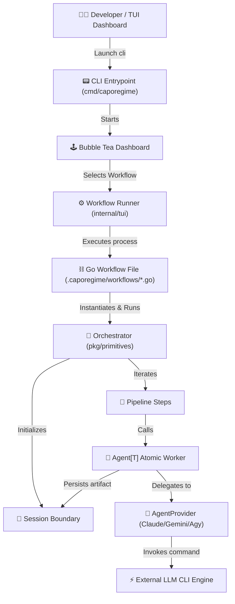

# 🌹 Don Caporegime

> *"An agentic orchestration framework you can't refuse."*

**Don Caporegime** is a powerful, lightweight, and structured Go-based framework for orchestrating AI agents and multi-step task pipelines. Part of the **Don** monorepo, it abstracts interactions with foundation model CLI engines (Google Antigravity `agy`, Anthropic `claude`, and `gemini` CLI) through type-safe, developer-friendly Go primitives.

It comes equipped with an interactive **Terminal User Interface (TUI) Dashboard** built on the Charmbracelet Bubble Tea stack for auto-discovering and running workflows with real-time log streaming.

---

## 🗺️ Architectural Flow

The diagram below illustrates how **Caporegime** coordinates workflow discovery, execution, session isolation, and provider integration:



---

## 🧬 Core Primitives

Caporegime is architected around five central concepts defined in the [`pkg/primitives`](file:///home/igor/Documents/projetos/don/caporegime/pkg/primitives) package:

### 1. 🤖 [Agent[T]](file:///home/igor/Documents/projetos/don/caporegime/pkg/primitives/agent.go)
An **Agent** is the atomic worker unit. It is generic over `T` (which must satisfy `FoundationModelResult`).
*   **Prompt Resolution**: Can take a raw prompt string or read from a `.md` template file.
*   **Hooks**: Supports `Before(ctx)` and `After(ctx)` callbacks to execute preprocessing/postprocessing.
*   **Safety & Validation**: Enforces output schemas (XML/JSON wrapper tags) and performs semantic failure checks.
*   **Artifact Generation**: Automatically saves outputs to the active session workspace.

### 2. 🔌 [AgentProvider](file:///home/igor/Documents/projetos/don/caporegime/pkg/primitives/AgentProvider.go)
The provider layer encapsulates command-line generation and response parsing for various LLM CLI backends:
*   [`AgyProvider`](file:///home/igor/Documents/projetos/don/caporegime/pkg/primitives/AgentProvider.go#L48): Integrates with Google Antigravity (`agy`).
*   [`ClaudeProvider`](file:///home/igor/Documents/projetos/don/caporegime/pkg/primitives/AgentProvider.go#L25): Integrates with the Anthropic Claude CLI (`claude`).
*   [`GeminiProvider`](file:///home/igor/Documents/projetos/don/caporegime/pkg/primitives/AgentProvider.go#L84): Integrates with the Gemini developer CLI (`gemini`).

### 3. 🧩 [Pipeline](file:///home/igor/Documents/projetos/don/caporegime/pkg/primitives/pipeline.go)
A **Pipeline** groups standard Go code, file operations, and agent execution steps into a single cohesive process block. It enforces cross-cutting concerns:
*   Pre-execution context cancellation checks.
*   Structured logging (`slog`) integration.
*   Pipeline-specific hooks and error wrapping.

### 4. 🧬 [Orchestrator](file:///home/igor/Documents/projetos/don/caporegime/pkg/primitives/orchestrator.go)
The top-level execution manager. It implements the `Workflow` interface and:
*   Sequences multiple `Pipeline` modules.
*   Aborts immediately on the first encountered step failure.
*   Initializes a unique filesystem `Session` before running workflows.

### 5. 📁 [Session](file:///home/igor/Documents/projetos/don/caporegime/pkg/primitives/session.go)
Every Orchestrator run creates an isolated session directory under `.caporegime/session/` using a UUID format: `YYYY-MM-DD-timestamp-randHex-name/`.
*   **`logs/run.log`**: Standard output and structured error logs are multiplexed directly to this file.
*   **`artifacts/`**: Workspace folder where agents write markdown documents or text files.

---

## 📟 TUI Dashboard

The dashboard ([`internal/tui`](file:///home/igor/Documents/projetos/don/caporegime/internal/tui)) acts as the control deck for your agentic processes:

*   **Workflow Discovery**: Scans `.caporegime/workflows` for Go source files. It extracts user-facing metadata using special code comments:
    ```go
    // name: Generate Release Notes
    // description: Synthesizes git logs into structured markdown.
    ```
*   **Process Isolation**: Executes each workflow as an isolated process (`go run <workflow>.go`), safeguarding TUI memory space from panic crashes.
*   **Real-time Logger Tab**: Splits the terminal screen to show running processes, allowing developers to monitor standard output streams in real-time.

---

## 📁 Runtime File Structure

When running, the framework manages the following structure in your project folder:

```text
.caporegime/
├── agents/             # Preconfigured Agent descriptors (JSON/YAML)
├── prompts/            # Reusable markdown prompt templates
├── session/            # Isolated orchestrator run databases
│   └── 2026-06-23-171917126100-3f4a2d-sample_orchestrator/
│       ├── artifacts/  # Persisted agent output markdown files
│       │   └── explanation_agent.md
│       └── logs/
│           └── run.log # Multiplexed execution output
└── workflows/          # Standalone Go workflow entrypoints
    ├── hello.go
    └── try_agentic.go
```

---

## 🚀 Getting Started

### Prerequisites
Make sure your system meets the requirements:
*   **Go**: `1.26.1+`
*   **External CLIs**: At least one LLM command-line interface installed and configured in your path (`agy`, `claude`, or `gemini`).


### 1. Install the CLI Binary
Install the CLI directly from GitHub:
```bash
go install github.com/dev-igorcarvalho/don/caporegime/cmd/caporegime@latest
```
> [!NOTE]
> Make sure your `$GOPATH/bin` (usually `~/go/bin`) is added to your system's `PATH` environment variable.

### 2. Initialize the Workspace
Initialize the default directory structures and template workflows:
```bash
caporegime -init
```

### 3. Run the Interactive Dashboard
Launch the dashboard to monitor and run workflows:
```bash
caporegime
```

### 4. Create Workflows with Primitives
Once the workspace is initialized, you can start writing your custom agent workflows inside `.caporegime/workflows/` using the provided primitives (like `Agent` and `Pipeline`). See the [Writing a Workflow](#✍️-writing-a-workflow) section for a complete template.

### 5. Run Tests & Code Quality
Verify codebase compliance:
```bash
# Run primitives tests
go test ./pkg/primitives/...

# Lint codebase
golangci-lint run ./...
```

---

## ✍️ Writing a Workflow

Writing a custom workflow involves defining `primitives.Agent` configurations, wrapping execution inside a `primitives.Pipeline`, and triggering them through an `Orchestrator`.

Create a file named `explain_agent.go` inside `.caporegime/workflows/`:

```go
// name: Agent Explanation Workflow
// description: Uses the AgyProvider to explain agents in markdown.
package main

import (
	"context"
	"fmt"
	"log"

	"github.com/dev-igorcarvalho/don/caporegime/pkg/primitives"
)

func main() {
	// 1. Configure the Agent
	explanationAgent := primitives.Agent[primitives.FoundationModelResponse]{
		Name:        "agent_explainer",
		Provider:    primitives.NewAgyProvider(),
		Description: "Explains agentic concepts using Google Antigravity",
		Model:       "gemini-3.5-flash",
		Prompt:      "Explain what an autonomous agent is in 30 lines.",
	}

	// 2. Wrap execution inside a Pipeline
	explainPipeline := primitives.NewPipeline("Explain Agent Concept", func(ctx context.Context) error {
		fmt.Println("Deploying explanation agent...")
		
		response, err := explanationAgent.Run(ctx)
		if err != nil {
			return fmt.Errorf("agent run failed: %w", err)
		}
		
		fmt.Printf("Success! Artifact saved to: %s\n", response.ArtifactPath)
		return nil
	})

	// 3. Coordinate using the Orchestrator
	orchestrator := primitives.NewOrchestrator("Agent Concept Orchestrator", explainPipeline)

	// 4. Run (Handles logging and session isolation automatically)
	if err := orchestrator.Run(context.Background()); err != nil {
		log.Fatalf("Orchestrator failed: %v", err)
	}
}
```

Now open the **Dashboard** (`go run cmd/caporegime/main.go`) or use the installed `caporegime` command, and your new workflow will automatically appear, ready to execute!

---

## 📄 License

This subproject is part of the **Don** monorepo and is licensed under the terms of the **GNU General Public License v3 (GPLv3)**. 

For terms, limits, and permissions, see the root [LICENSE](../LICENSE) file.

---

## 👥 Contacts & Info

Developed and maintained by **Igor Carvalho**.
*   **Email**: [dev.igorcarvalho@gmail.com](mailto:dev.igorcarvalho@gmail.com)
