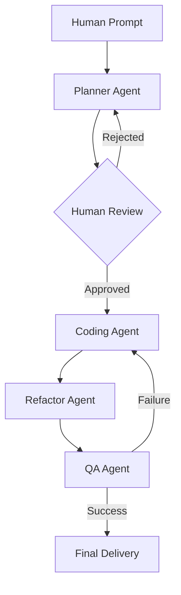

# Agentic Workflow: Don Project

This document outlines a structured agentic workflow designed to ensure high-quality code delivery, architectural consistency, and robust verification within the **Don** project.

## Workflow Overview

The workflow follows a linear progression with integrated human oversight and specialized agent roles.

### Phase 1: Planning (The Architect)
**Goal:** Create a technical blueprint for the request.
- **Input:** Human prompt + Project Context (`GEMINI.md`).
- **Actions:**
    - Use `codebase_investigator` to map dependencies.
    - Identify required changes in `internal/core`, `internal/adapters`, etc.
    - Define the testing strategy (Unit, Integration).
    - **Output:** A structured `PLAN.md` or a detailed response for human review.

### Phase 2: Human Review (The Checkpoint)
**Goal:** Align agent intent with human expectations.
- **Input:** Proposed Plan.
- **Actions:** Human validates architectural decisions and scope.
- **Output:** Approval to proceed or feedback for plan refinement.

### Phase 3: Coding (The Implementer)
**Goal:** Execute the approved plan.
- **Input:** Approved Plan.
- **Actions:**
    - Activate `go-standards` skill.
    - Perform surgical edits using `replace` or `write_file`.
    - Adhere to Hexagonal Architecture (keep domain pure).
    - Implement initial tests.
- **Output:** Modified codebase with basic functionality.

### Phase 4: Refactor (The Polisher)
**Goal:** Ensure code quality and standards.
- **Input:** Modified codebase.
- **Actions:**
    - Activate `go-standards` skill.
    - Check for naming conventions, group declarations, and error handling patterns.
    - Optimize for readability and performance.
- **Output:** Refined code following project idioms.

### Phase 5: QA (The Validator)
**Goal:** Verify correctness and prevent regressions.
- **Input:** Refined codebase + Original requirements.
- **Actions:**
    - Run `go test ./...`.
    - Execute `golangci-lint` (as defined in `.golangci.yml`).
    - Verify all edge cases defined in the Planning phase.
- **Output:** Test reports and final verification. If failure occurs, it triggers a loop back to the Coding Agent.

---

## Detailed Implementation of Improvements

### 1. Multi-Agent Feedback Loops
**Implementation:**
- **Error Capture:** Configure the QA Agent to catch non-zero exit codes from `go test` and `golangci-lint`.
- **Diagnostic Agent:** If a failure occurs, invoke a specialized **Diagnostic Agent**. This agent's prompt should instruct it to:
    1. Parse the standard error/output from the failed tool.
    2. Identify the specific files and line numbers causing the failure.
    3. Extract the relevant code blocks using `read_file`.
- **Retry Logic:** Feed the diagnostic report back to the **Coding Agent** with a "Fix Directive". Limit retries (e.g., 3 attempts) before escalating to the Human Reviewer.

### 2. Specialized Security Agent
**Implementation:**
- **Tool Integration:** Add a step in the workflow to run `govulncheck ./...` via `run_shell_command`.
- **Pattern Matching:** Use `grep_search` with a library of "Insecurity Patterns" (e.g., searching for `http.ListenAndServe` without TLS in production-like configs, or usage of `crypto/md5`).
- **Secret Scanning:** Use a shell command like `gitleaks` (if available) or a custom regex search against `.env` patterns and hardcoded strings before any commit.

### 3. Automated Frontmatter & Documentation
**Implementation:**
- **Skill Activation:** At the end of the Refactor phase, the system calls `activate_skill("frontmatter-adder")`.
- **Batch Processing:** Run the skill on the entire `internal/` and `pkg/` directories to ensure consistency.
- **Verification:** The QA Agent verifies that every new `.go` file has a valid YAML frontmatter block and that the description matches the implementation logic.

### 4. Context Pruning (Manifest-Driven)
**Implementation:**
- **Planner Output:** The Planner Agent must output a `manifest` section in its plan, listing absolute file paths.
- **Dynamic Context Loading:** Instead of providing the full file tree to subsequent agents, the workflow controller uses `read_file` only for the files listed in the manifest.
- **Expansion Hook:** If a Coding Agent discovers it needs an unlisted file, it must issue a "Context Expansion Request" to the controller to fetch that file.

### 5. Semantic Commit Integration
**Implementation:**
- **Skill Hook:** Once the QA Agent issues a "Success" signal, the controller calls `activate_skill("semantic-commit")`.
- **Input Mapping:** The original Human Prompt and the Planner's `PLAN.md` are provided to the skill to help it generate high-quality, intent-focused commit messages (e.g., `feat(api): implement health check endpoint based on architectural plan`).

### 6. State Persistence (Recovery Mode)
**Implementation:**
- **State File:** Create a `.gemini/workflow_state.json` (ensure it is in `.gitignore`).
- **Snapshotting:** After every tool execution (especially `replace` or `write_file`), update the JSON with:
    - `current_phase`: (e.g., "Refactoring")
    - `pending_tasks`: (from the original plan)
    - `last_successful_tool`: (id and output)

---

## Harness Implementation Plan: Wiring it Together

This plan details how to build a "Harness" (a controller or orchestrator) that executes this workflow autonomously within the Gemini CLI environment.

### 1. Phase 0: The Controller Setup
**Objective:** Create a central execution script or a "Master Agent" prompt.
- **Approach:** Use a `HARNESS_GUIDE.md` (or a specialized subagent) that acts as the "State Machine".
- **Tooling:** Use `run_shell_command` to manage the lifecycle and `invoke_agent` for specialized tasks.

### 2. Step-by-Step Execution Logic

#### Step A: Initial Intake & Planning
- **Command:** `invoke_agent(agent_name="codebase_investigator", prompt="[User Prompt] + Create a manifest of required files and a PLAN.md")`
- **Verification:** The harness pauses and waits for the user to read the generated `PLAN.md`.
- **User Action:** User types "Approved" or provides feedback.

#### Step B: Implementation Loop (Coding + Refactor)
- **Command:** `invoke_agent(agent_name="generalist", prompt="Execute Step X of PLAN.md using the manifest. Then activate 'go-standards' and refactor the changes.")`
- **Automation:** The harness automatically saves the state to `.gemini/workflow_state.json` after the agent returns.

#### Step C: The QA Gate & Feedback Loop
- **Command:** `run_shell_command(command="go test ./... && golangci-lint run")`
- **Conditional Logic:**
    - **IF Exit Code == 0:** Proceed to Step D.
    - **IF Exit Code != 0:** 
        1. Capture output to `error.log`.
        2. `invoke_agent(agent_name="generalist", prompt="Fix the following errors: [error.log contents].")`
        3. Repeat Step C (max 3 times).

#### Step D: Finalization & Metadata
- **Command:** `activate_skill("frontmatter-adder")` followed by `activate_skill("semantic-commit")`.
- **Completion:** Harness prints a final summary and deletes `workflow_state.json`.

### 3. Wiring the Subagents
To ensure agents don't "drift," provide each `invoke_agent` call with a **Role-Specific System Prompt Override**:
- **Planner:** "You are a Senior Architect. Your only output should be a manifest and a PLAN.md."
- **Coder:** "You are a Surgical Developer. Use 'replace' for minimal changes. Follow the manifest strictly."
- **QA:** "You are a Zero-Tolerance Tester. Run all tests and lints. Do not accept 'it looks fine'—only green logs."

### 4. Safety & Recovery Hooks
- **Persistence:** Every tool call by any subagent should be logged by the harness.
- **Circuit Breaker:** If the "QA -> Coder" loop happens 3 times without a change in the error log, the harness must halt and ask for human intervention.
- **Rollback:** Maintain a `git stash` before Step B. If the user rejects the final QA result, the harness can `git stash pop` or `git reset --hard` to restore the state.

