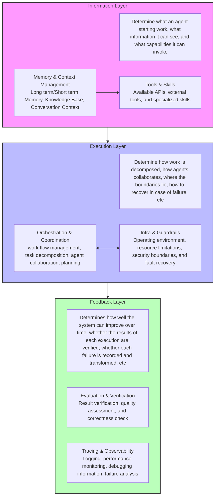

# Key Components of Harness: A Three-Layer Architecture

## ASCII Diagram

```text
+---------------------------------------------------------------------------------------+
|                                    Information Layer                                  |
|   Determine what an agent starting work, what information it can see, and what        |
|                            capabilities it can invoke                                 |
|                                                                                       |
|  +---------------------------------------+         +-------------------------------+  |
|  |     Memory & Context Management       | ------> |        Tools & Skills         |  |
|  | Long term/Short term Memory, Knowledge|         | Available APIs, external      |  |
|  | Base, Conversation Context            |         | tools, and specialized skills |  |
|  +---------------------------------------+         +-------------------------------+  |
+---------------------------------------------------------------------------------------+
                                        |
                                        v
+---------------------------------------------------------------------------------------+
|                                     Execution Layer                                   |
|   Determine how work is decomposed, how agents collaborates, where the boundaries     |
|                   lie, how to recover in case of failure, etc                         |
|                                                                                       |
|  +---------------------------------------+         +-------------------------------+  |
|  |     Orchestration & Coordination      | <-----> |       Infra & Guardrails      |  |
|  | work flow management, task decomposi- |         | Operating environment, resou- |  |
|  | tion, agent collaboration, planning   |         | rce limitations, security...  |  |
|  +---------------------------------------+         +-------------------------------+  |
+---------------------------------------------------------------------------------------+
                                        |
                                        v
+---------------------------------------------------------------------------------------+
|                                     Feedback Layer                                    |
|   Determines how well the system can improve over time, whether the results of each   |
|     execution are verified, whether each failure is recorded and transformed, etc     |
|                                                                                       |
|  +---------------------------------------+         +-------------------------------+  |
|  |      Evaluation & Verification        |         |     Tracing & Observability   |  |
|  | Result verification, quality assess-  |         | Logging, performance monitor- |  |
|  | ment, and correctness check           |         | ing, debugging info...        |  |
|  +---------------------------------------+         +-------------------------------+  |
+---------------------------------------------------------------------------------------+
```

## Mermaid Diagram


